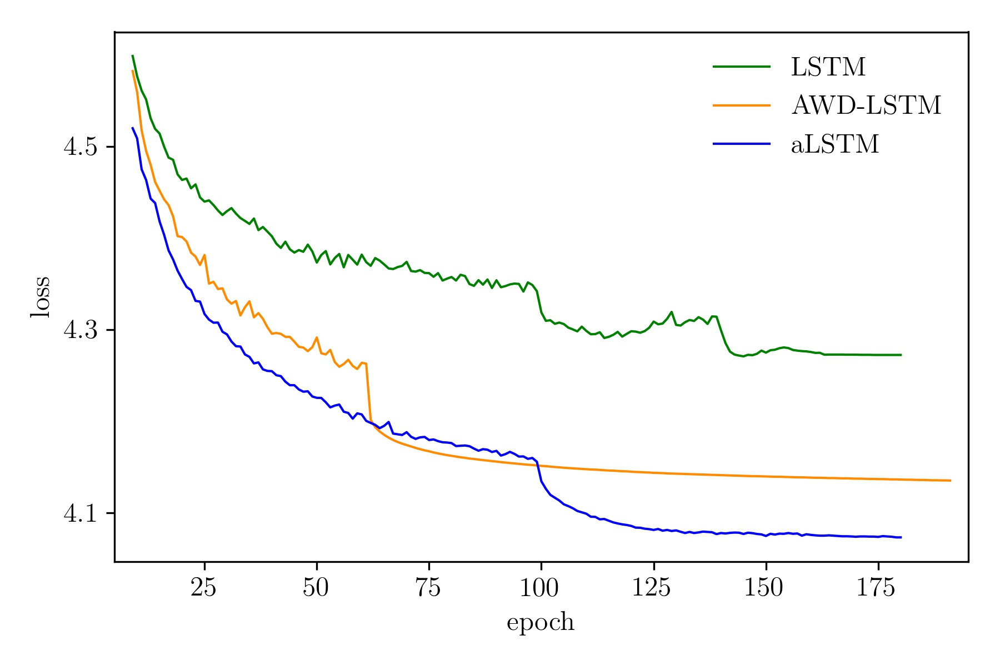

# Adaptive LSTM for Language Modeling 

These examples replicate the experiments in the original paper ([https://arxiv.org/abs/1805.08574](https://arxiv.org/abs/1805.08574)). The training code base is derived from
[https://github.com/salesforce/awd-lstm-lm](https://github.com/salesforce/awd-lstm-lm), in turn derived from the official PyTorch language model [example](https://github.com/pytorch/examples/tree/master/word_language_model).

## Setup

Install [PyTorch](https://pytorch.org/) and [alstm](https://github.com/flennerhag/alstm) and download the data you want to use (``p`` for Penn Treebank and ``w`` for Wikitext-2):

```bash
getdata.sh -pw 
```

## Train

### Penn Treebank

To train the aLSTM on Penn Treebank, run

```bash
python main.py --model ALSTM --epochs 190 --emsize 400 --nhid 1150 --nlayers 2 --npar 100 --dropouth 0.25 --dropoute 0.16 --dropouti 0.6 --dropouto 0.6 --dropouta 0.1 --wdecay 1e-6 --var-seq --seq-len 70 --batch_size 20 --cut-steps 100 160 --cut-rate 10 --save
```

This will give you val / test scores of ``58.7`` / ``56.5``.

### Wikitext-2

To train the aLSTM on Wikitext-2, run

```bash
python main.py --model ALSTM --epochs 187 --emsize 400 --nhid 1500 --nlayers 2 --npar 100 --dropouth 0.25 --dropoute 0.16 --dropouti 0.6 --dropouto 0.6 --dropouta 0.1 --wdecay 1e-6 --var-seq --seq-len 70 --batch_size 20 --cut-steps 80 160 200 --cut-rate 10 --save --data data/wikitext-2
```

This will give you val / test scores of ``67.5`` / ``64.8``.

The API for the language model is the same as that of the [AWD-LSTM](https://github.com/salesforce/awd-lstm-lm), so you can use any post-processing scripts they have, such as fine tuning, adding a [neural cache](https://arxiv.org/abs/1612.04426) or generating samples. 

## Benchmark

<div align="center">
<br><br>
</div>

